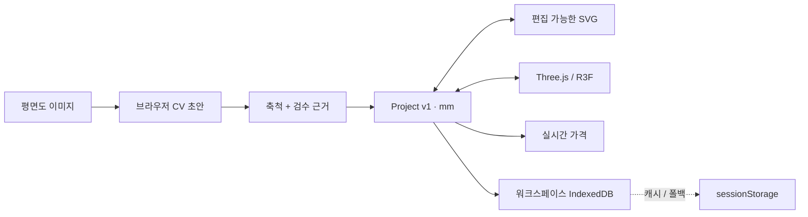

<p align="right"><a href="./README.md">English</a></p>

<div align="center">

# 홈플랜 3D

### 평면도를 넣으면, 수정 가능한 공간이 나옵니다.

평면도 이미지를 SVG 편집, 3D 배치, 가격과 워크스루가 연결된 하나의
mm 기반 프로젝트로 바꾸는 브라우저 우선 인테리어 플래너입니다.

[실서비스 열기](https://interior3d-gray.vercel.app) ·
[제품 개요](docs/products/index.html) ·
[아키텍처](docs/products/architecture.html) ·
[워크플로우](docs/products/workflow.html)


[](https://github.com/showjihyun/wn-interior/actions/workflows/verify.yml)

</div>

## 30초 안에 보기


목업이 아니라 실제 앱을 Chromium으로 조작한 영상입니다. 한국 33평 도면을 올리고
**11,800mm**로 축척을 보정한 뒤, SVG 초안을 검수하고 같은 프로젝트를 3D로 열어 실측 IKEA
KIVIK을 배치합니다. 가격 갱신과 워크스루까지 한 흐름으로 이어집니다.

> CV 결과를 정답처럼 제시하지 않습니다. 변환은 명시적인 초안이며, 잘못된 축척의 조용한 적용을
> 막고 사람의 검토를 핵심 여정에 유지합니다.

## 하나의 프로젝트, 모든 화면

2D와 3D는 서로 내보낸 복사본이 아닙니다. 두 화면은 버전이 고정된
`Project { plan, placements, customProducts, floorPlanReview }`를 함께 읽고 수정하며, 저장되는
모든 치수는 mm를 사용합니다.



## 현재 동작하는 범위

| 영역            | 현재 동작                                                                 |
| --------------- | ------------------------------------------------------------------------- |
| 평면도 가져오기 | 클라우드 AI 없는 브라우저 CV, 실측 축척과 검수 근거를 거쳐 3D 진입        |
| 편집            | 벽·방·개구부·치수를 접근 가능한 SVG에서 계속 수정                         |
| 배치            | 25mm 그리드, 벽 자석, 충돌 검사, 회전, Undo/Redo, A/B 배치안              |
| 설치 관계       | capability chain으로 surface 제품 연결, 부모 이동 추종과 쉬운 분리        |
| 실상품 데이터   | 출처를 보존한 IKEA Korea 15종, JSON/CSV/XLSX 규격과 한샘·리바트 bridge    |
| 가격            | Object 추가·삭제 시 가격 확인·미확인 항목을 즉시 재계산                   |
| 저장            | URL 워크스페이스별 IndexedDB 자동 저장, 세션 폴백, Project JSON 전체 왕복 |
| 워크스루        | 1·3인칭, 벽·가구 충돌, 달리기, 점프와 Object 위 착지                      |

## 제품 시스템 문서

HTML 문서는 구현된 사실, 운영상 한계와 미래 계획을 구분해서 설명합니다.

| 문서                                               | 확인할 내용                                                |
| -------------------------------------------------- | ---------------------------------------------------------- |
| [제품 개요](docs/products/index.html)              | 제품 약속, 증거 경계와 현재 우선순위                       |
| [시스템 아키텍처](docs/products/architecture.html) | 레이어, 런타임 조립, 상태·저장·배포 경계                   |
| [제품 워크플로우](docs/products/workflow.html)     | 도면, 연결·분리, catalog import, 저장 왕복, 실패·배포 흐름 |

## 로컬 실행

Node.js 22.19+와 npm이 필요하며 CI는 Node.js 24에서 실행됩니다.

```bash
npm install
npm run dev
```

`http://localhost:5173`을 엽니다.

```bash
npm test          # 결정론적 단위·계약 테스트
npm run verify    # 정책·자산·아키텍처·lint·coverage·build
npm run test:e2e  # 실제 Chromium 제품 여정
npm run verify:full
```

## 사용자 워크플로우

1. **평면도 업로드 → 3D**를 누릅니다.
2. PNG/JPG를 올리고 실제 가로 치수 하나를 입력합니다.
3. 원본과 검출된 벽·방·문·창문을 비교합니다.
4. 정규화한 초안을 적용하고 2D에서 검수 근거를 저장한 뒤 3D를 엽니다.
5. 실측 제품을 배치합니다. 호환되는 주방 Object는 support chain에 연결됩니다.
6. 배치안과 가격을 비교하고 공간을 걸어본 뒤 전체 프로젝트를 내보냅니다.

## 아키텍처 요약

```text
src/
├─ domain/              mm 모델과 지오메트리·배치·설치·보행 규칙
├─ application/         편집·히스토리·프로젝트·CV·견적·catalog·자동저장 유스케이스
├─ infrastructure/      브라우저 저장소, HTTP 어댑터와 출처가 있는 기준 데이터
├─ presentation/        React/Zustand 바인딩, SVG/R3F 화면과 텍스처 엔진
├─ compositionRoot.ts   구체 의존성 조립
└─ main.tsx             브라우저 부트스트랩
```

의존성은 `domain ← application ← infrastructure / presentation` 방향으로 향합니다. 정적 정책
테스트와 DOM 없는 TypeScript 빌드가 이 경계를 검사합니다. 자세한 내용은
[아키텍처 문서](docs/products/architecture.html)를 참고하세요.

## 카탈로그 프로토콜

HomePlan Catalog Protocol 1.0은 외부 데이터를 내부 `Product`로 만들기 전에 출처, 치수, 가격,
taxonomy, variants와 설치 capability를 정규화합니다. 브랜드별 web override와 CSV/XLSX preset이
사이트 차이를 도메인 모델 바깥에서 흡수합니다.

```powershell
npm run catalog:convert-sheet -- `
  --input public/catalog-templates/hanssem-catalog-template.xlsx `
  --config schemas/templates/hanssem-sheet.config.json `
  --output output/hanssem.catalog.json
```

[스프레드시트 bridge 규격](docs/CATALOG-SPREADSHEET-BRIDGE.md)을 참고하세요. 이 규격은 현재
저장소에서 검증되는 버전형 계약이며 아직 업계 표준으로 입증된 것은 아닙니다. 광범위한 호환성은
실제 adapter coverage로 측정해야 합니다.

## 주요 조작

| 동작          | 조작                                                 |
| ------------- | ---------------------------------------------------- |
| 이동·회전     | 드래그 · `R` / `Shift+R` · 인스펙터                  |
| 배치 취소     | `Esc`                                                |
| 삭제·히스토리 | `Delete` · `Ctrl+Z` / `Ctrl+Y`                       |
| 화면 전환     | `1`은 2D · `3`은 3D                                  |
| 워크스루      | 마우스 시선 · `WASD` · `Space` 점프 · `Shift` 달리기 |
| 연결·분리     | 호환 surface에 배치 · 인스펙터에서 분리              |

## 정확도와 신뢰 경계

- 고정 홀드아웃 900건에서 선택적 로컬 CNN hybrid는 **방 F1 47.52%**, **벽 F1 76.63%**,
  개구부 직접 벡터화는 **문 위치 F1 87.07%**, **창 위치 F1 82.97%**를 기록했습니다. 자동 완성을
  주장할 수준은 아닙니다.
- CubiCasa 계열 체크포인트는 **CC BY-NC 4.0**이며 명시적 연구 모드가 아니면 production에서
  비활성입니다.
- 생성 GLB는 source hash, 권리 기록과 사람 검수를 독립적으로 통과할 때까지 오프라인 검역에
  머뭅니다. 배치에는 항상 공식 mm 치수를 사용합니다.
- IndexedDB는 같은 브라우저의 지속성을 제공할 뿐 계정 백업이나 기기 간 동기화가 아닙니다. 장기
  보관은 JSON 내보내기를 사용해야 합니다.
- 이사·리모델링 예정 사용자 3–5명의 관찰 검증은 아직 진행 전입니다. 자동 E2E는 초행 사용성을
  입증하지 않습니다.

근거: [정확도 감사](docs/evidence/CV-ACCURACY-AUDIT.md) ·
[실도면 회귀](docs/evidence/CV-REAL-FLOORPLAN-10.md) ·
[사용자 검증 계획](docs/USER-VALIDATION.md) ·
[외부 자산 정책](THIRD_PARTY_ASSETS.md)

## 데모 GIF 다시 만들기

```bash
# terminal 1
npm run dev

# terminal 2
npx playwright install chromium
npm run demo:gif
```

캡처 스크립트는 `docs/assets/homeplan-3d-demo.gif`에 **30초, 150프레임, 960×540** 반복 영상을
생성하며 앱이 실행 중이 아니면 실패합니다.

## 라이선스

원본 소스코드는 [MIT License](LICENSE)로 공개됩니다. IKEA 상품 사진, 상표, 제품 디자인과 파생
GLB에는 MIT가 적용되지 않습니다. 이 프로젝트는 IKEA와 제휴·후원·승인 관계가 아닙니다.
