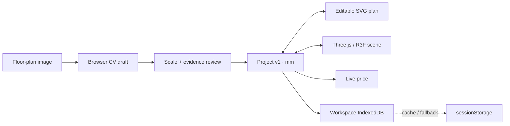

<p align="right"><a href="./README.ko.md">한국어</a></p>

<div align="center">

# HomePlan 3D

### Floor plan in. Editable space out.

A browser-first interior planner that turns a floor-plan image into one shared,
millimetre-based project for SVG editing, 3D placement, pricing and walkthroughs.

[Open the live app](https://interior3d-gray.vercel.app) ·
[Product overview](docs/products/index.html) ·
[Architecture](docs/products/architecture.html) ·
[Workflows](docs/products/workflow.html)


[](https://github.com/showjihyun/wn-interior/actions/workflows/verify.yml)

</div>

## See it in 30 seconds


This is the real application driven in Chromium, not a mockup. The recording uploads a Korean
33-pyeong plan, calibrates it to **11,800mm**, reviews the editable SVG draft, opens the same
project in 3D, places a real-size IKEA KIVIK, updates the price and enters walkthrough mode.

> HomePlan 3D does not present computer vision as ground truth. Conversion creates an explicit
> draft, blocks silent scale mistakes and keeps human review in the main journey.

## One project, every view

2D and 3D are not exported copies of each other. They read and mutate the same versioned
`Project { plan, placements, customProducts, floorPlanReview }`; all persisted dimensions use
millimetres.



## What works today

| Area              | Current behaviour                                                                                              |
| ----------------- | -------------------------------------------------------------------------------------------------------------- |
| Floor-plan import | Browser CV needs no cloud AI; known-width calibration and review evidence gate 3D                              |
| Editing           | Walls, rooms, openings and dimensions remain editable in accessible SVG                                        |
| Placement         | 25mm grid, wall magnetism, collision checks, rotation, Undo/Redo and A/B layouts                               |
| Installation      | Surface products attach through capability chains; support objects move with their children and detach cleanly |
| Retail data       | 15 sourced IKEA Korea products; JSON/CSV/XLSX catalog protocol and Hanssem/Livart bridges                      |
| Cost              | Adding or deleting a placed product immediately recalculates priced and unpriced lines                         |
| Persistence       | URL-workspace IndexedDB autosave, session fallback and full Project JSON round-trip                            |
| Walkthrough       | First/third person, wall and furniture collision, run, jump and object-top landing                             |

## Read the product system

The HTML documents separate implemented facts from operational limits and future intent. They are
currently authored in Korean, with English code identifiers preserved.

| Document                                               | Use it for                                                                        |
| ------------------------------------------------------ | --------------------------------------------------------------------------------- |
| [Product overview](docs/products/index.html)           | Product promise, evidence boundary and current priorities                         |
| [System architecture](docs/products/architecture.html) | Layers, runtime composition, state, persistence and deployment boundaries         |
| [Product workflows](docs/products/workflow.html)       | Floor plan, attach/detach, catalog import, round-trip, failure and delivery flows |

## Start locally

Requires Node.js 22.19+ and npm. CI runs on Node.js 24.

```bash
npm install
npm run dev
```

Open `http://localhost:5173`.

```bash
npm test          # deterministic unit and contract tests
npm run verify    # policy, assets, architecture, lint, coverage and build
npm run test:e2e  # real Chromium product journeys
npm run verify:full
```

## Product workflow

1. Click **평면도 업로드 → 3D** (_Floor plan upload → 3D_).
2. Upload PNG/JPG and enter one known horizontal dimension.
3. Compare the source image with detected walls, rooms, doors and windows.
4. Apply the normalized draft, record review evidence in 2D, then open 3D.
5. Place real-size products; compatible kitchen objects attach to their support chain.
6. Compare layouts and prices, walk the space, then export the complete project.

## Architecture at a glance

```text
src/
├─ domain/              mm models and geometry, placement, installation and walk rules
├─ application/         editing, history, project, CV, quote, catalog and autosave use cases
├─ infrastructure/      browser persistence, HTTP adapters and sourced reference data
├─ presentation/        React/Zustand bindings, SVG/R3F views and texture engine
├─ compositionRoot.ts   concrete dependency wiring
└─ main.tsx             browser bootstrap
```

Dependencies point inward: `domain ← application ← infrastructure / presentation`. Static policy
tests and DOM-free TypeScript builds protect that boundary. See the
[full architecture document](docs/products/architecture.html).

## Catalog protocol

HomePlan Catalog Protocol 1.0 normalizes provenance, dimensions, price, taxonomy, variants and
installation capabilities before data becomes an internal `Product`. Brand-specific web overrides
and CSV/XLSX presets absorb source differences outside the domain model.

```powershell
npm run catalog:convert-sheet -- `
  --input public/catalog-templates/hanssem-catalog-template.xlsx `
  --config schemas/templates/hanssem-sheet.config.json `
  --output output/hanssem.catalog.json
```

See the [spreadsheet bridge specification](docs/CATALOG-SPREADSHEET-BRIDGE.md). This is a versioned
repository contract, not yet a proven industry standard; broad compatibility requires measured
adapter coverage.

## Controls

| Action           | Control                                                   |
| ---------------- | --------------------------------------------------------- |
| Move / rotate    | Drag · `R` / `Shift+R` · inspector controls               |
| Cancel placement | `Esc`                                                     |
| Delete / history | `Delete` · `Ctrl+Z` / `Ctrl+Y`                            |
| Switch view      | `1` for 2D · `3` for 3D                                   |
| Walk             | Mouse look · `WASD` · `Space` jump · `Shift` run          |
| Attach / detach  | Place on a compatible surface · detach from the inspector |

## Accuracy and trust boundaries

- On the fixed 900-plan holdout, the optional local CNN hybrid reached **47.52% room F1** and
  **76.63% wall F1**. Direct opening vectorization reached **87.07% door-location F1** and
  **82.97% window-location F1**. These results do not justify autonomous completion.
- CubiCasa-derived checkpoints are **CC BY-NC 4.0** and production-off unless research mode is
  explicitly enabled.
- Generated GLBs remain offline and quarantined until their source hash, rights record and human
  review independently pass. Placement always uses official millimetre dimensions.
- IndexedDB provides same-browser persistence, not account backup or cross-device sync. Export JSON
  for external or long-term storage.
- Target-user observation with 3–5 movers or renovators is still pending; automated E2E does not
  prove first-time usability.

Evidence: [accuracy audit](docs/evidence/CV-ACCURACY-AUDIT.md) ·
[real-plan regression](docs/evidence/CV-REAL-FLOORPLAN-10.md) ·
[user validation plan](docs/USER-VALIDATION.md) ·
[third-party asset policy](THIRD_PARTY_ASSETS.md)

## Rebuild the demo GIF

```bash
# terminal 1
npm run dev

# terminal 2
npx playwright install chromium
npm run demo:gif
```

The capture script writes a **30-second, 150-frame, 960×540** loop to
`docs/assets/homeplan-3d-demo.gif` and fails if the application is not running.

## License

Original source code is available under the [MIT License](LICENSE). IKEA product photography,
trademarks, product designs and derivative GLBs are not covered by MIT. This project is not
affiliated with, sponsored by or endorsed by IKEA.
