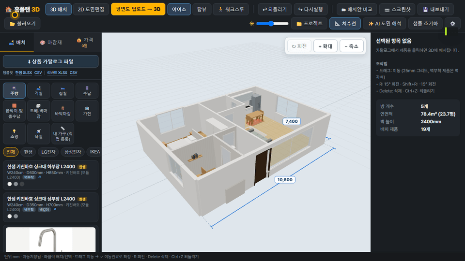
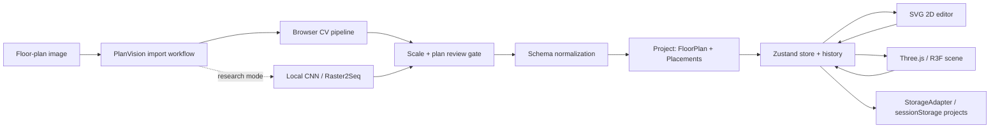

<a id="english"></a>

# HomePlan 3D

### Upload a floor plan. Calibrate one real dimension. Walk through the result.

[English](#english) | [한국어](#한국어)


[](https://github.com/showjihyun/wn-interior/actions/workflows/verify.yml)

HomePlan 3D is a browser-based interior planner that turns a floor-plan image into one shared, millimetre-based project rendered as both an editable SVG plan and an interactive 3D scene.

The core import path needs no cloud AI: upload an image, enter one known width, compare the vector overlay, then continue in 2D or jump straight into 3D. Furniture snaps to walls, respects room boundaries, collides at real dimensions, survives save/reload, and can be explored in first or third person.

> This is not a “one-click truth machine.” Conversion produces an explicit draft, blocks silent scale mistakes, surfaces suspicious results, and keeps human correction in the loop.

## 20-second demo



The GIF is generated from the real application—not a mockup—with `npm run demo:gif`.

What you are seeing: the browser CV path ingests a real Korean 33-pyeong plan, detects **25 walls, 6 rooms, and 7 openings**, calibrates the width to **11,800mm**, preserves those openings through Apply, and renders the same project in 3D and 2D.

## Why this is fun

- **Image → editable geometry → 3D**, without flattening the result into a screenshot.
- **One source of truth:** 2D and 3D render the same `Project { plan, placements }` in millimetres.
- **Scale cannot fail silently:** enter a known width or explicitly accept estimated scale before Apply is enabled.
- **Correction-first UX:** walls, rooms, openings, and dimensions remain editable after conversion.
- **Real interior behaviour:** 25mm grid snap, wall magnetism, collision rejection, installation height, Undo/Redo, and A/B variants.
- **Real retail snapshot:** twelve IKEA Korea products include official article numbers, measured dimensions, price basis, source images and image-projected 3D materials.
- **Silhouette-preserving photo projection:** low-alpha white haze is excluded from crop bounds and every front/top/curtain cutout keeps its source aspect ratio inside the official measured envelope.
- **Product-aware fallback shapes:** real products keep official dimensions while product-specific geometry avoids misleading generic stand-ins, including the two-cushion low-arm KIVIK, FADO, BILLY, NORDEN, PAX/FORSAND, a mattress-free MALM frame and a lower-shelf LACK table.
- **Named footprint states:** transformable products can expose official dimension variants; NORDEN switches between 26/89/152cm and the same override drives visuals, collision, selection, Undo/Redo and persistence.
- **Trust-separated hybrid visuals:** only hash-pinned, rights-reviewed and human-approved generated GLBs can replace the image projection; placement and collision always keep using official millimetre dimensions.
- **Offline mesh quarantine:** a local-only worker adapter stages outputs outside `public/`, inspects real GLB vertices/triangles, and publishes only from independent rights and review records.
- **Local review before publication:** an explicitly selected quarantine record can be rendered in the development room with a `로컬 생성 3D · 검수 중` badge while production builds remain on the official-photo fallback.
- **Reproducible local model service:** the pinned TripoSR Docker worker runs on `127.0.0.1:8980` with CUDA, a 20MB upload limit and one GPU job at a time.
- **Evidence-gated view selection:** high-resolution regeneration evaluates only same-variant whole-product views; detail crops cannot win on numerical mesh scores alone.
- **Walk the plan:** first-person and third-person navigation with wall and furniture collision.
- **Honest model boundary:** CubiCasa-derived research models are disabled in production unless research mode is explicitly enabled.

## The product workflow

1. Click **평면도 업로드 → 3D** (_Floor plan upload → 3D_).
2. Upload PNG/JPG and enter one real horizontal dimension.
3. Compare the original with detected walls, rooms, doors, and windows.
4. Resolve scale and detection warnings, then apply the draft.
5. Choose **Correct in 2D** or **View 3D now**.
6. Verify wall connections, room boundaries, openings, and dimensions.
7. Place real-size products, compare variants, walk the result, and export.

## Architecture



### Data invariants

| Boundary        | Invariant                                                                                 |
| --------------- | ----------------------------------------------------------------------------------------- |
| Geometry        | All persisted lengths use millimetres.                                                    |
| 2D / 3D         | Both views read and mutate the same project state.                                        |
| Import          | Invalid geometry and low-coverage, over-dense wall results are blocked before store load. |
| Scale           | Estimated scale remains in 2D until source overlay and four review items are confirmed.   |
| Persistence     | Project IDs isolate imports; each tab session autosaves separately and survives reload.   |
| Research models | Non-commercial checkpoints are development/research-only and production-off by default.   |

### Import pipeline

```text
RGBA image
  → Otsu / luminance binarization
  → inversion + denoise + morphological close
  → horizontal / vertical wall bands
  → room contours + door/window candidates
  → known-width scale calibration
  → review issues + opening sanitization
  → normalized FloorPlan
  → Correct in 2D | View 3D now
```

### Repository map

```text
src/
├─ domain/              Millimetre models and geometry/placement/walk rules
├─ application/         Editing, history, project, CV, quote and autosave use cases
├─ infrastructure/      HTTP/browser-storage adapters and sourced retail snapshots
├─ presentation/        React/Zustand bindings, SVG/R3F views and texture engine
├─ compositionRoot.ts   Concrete dependency wiring
└─ main.tsx             Runtime bootstrap

e2e/                    Real-browser product journeys and CV fixtures
docs/evidence/          Accuracy, model and license audits
docs/tdd/               Reproducible RED → GREEN → REFACTOR evidence
```

## Development workflow

Behaviour changes follow a verifiable cycle:

```text
Acceptance contract
  → RED: run the smallest test and record the intended failure
  → GREEN: implement the minimum behaviour
  → REFACTOR: run coverage, browser E2E and production preview
  → Evidence note in docs/tdd/
```

The repository rejects assertion-free test files, committed `.only`, and comments pretending to be RED evidence. See [the TDD workflow](docs/TDD-WORKFLOW.md) and [feature-completeness rubric](docs/CORE-FEATURE-COMPLETENESS.md).

## Quick start

Requirements: Node.js 22.19+ and npm. CI runs on Node.js 24.

```bash
npm install
npm run dev
```

Open `http://localhost:5173`.

### Verification commands

```bash
npm test               # Vitest unit/contract tests
npm run test:contracts # assertion/.only/false-RED guard
npm run test:retail-assets # retail image file/SHA-256 contract
npm run typecheck:architecture # DOM-free domain/application compile
npm run test:coverage  # tests + global and high-risk coverage floors
npm run test:e2e       # Playwright against the development app
npm run test:preview   # production build + preview smoke tests
npm run verify         # contracts + lint + format + coverage + build
npm run verify:full    # everything above + E2E + production preview
npm run mesh:experiment:kivik -- --fetch # local-only KIVIK source/model feasibility A/B
npm run mesh:experiment:kivik:regenerate # hash-verified eligible-view regeneration + quarantine report
```

### Rebuild the README GIF

```bash
# terminal 1
npm run dev

# terminal 2
npx playwright install chromium
npm run demo:gif
```

This records the checked-in Korean 33-pyeong fixture and writes `docs/assets/homeplan-3d-demo.gif` as a 20-second, 960×540 animation.

## Optional local CNN research mode

The browser CV path works without Python. The optional CubiCasa-derived CNN improves research benchmarks but is **CC BY-NC 4.0** and must not be treated as commercially deployable.

```powershell
pip install -r scripts/requirements-cv.txt
pip install torch --index-url https://download.pytorch.org/whl/cu128  # NVIDIA

npm run cv:setup
npm run cv:server
npm run dev
```

CUDA is preferred; CPU is the fallback. Production builds disable non-commercial models unless `VITE_ENABLE_NONCOMMERCIAL_RESEARCH_MODE=true` is deliberately supplied. See the [license comparison](docs/evidence/CV-LICENSE-COMPARISON.md).

## Accuracy, without the hand-waving

On the fixed 900-plan holdout, the local CNN hybrid reached **47.52% room F1** and **76.63% wall F1**. Direct opening vectorization later reached **87.07% door-location F1** and **82.97% window-location F1** on that holdout.

Those numbers are useful, but room extraction is not reliable enough for autonomous completion. HomePlan 3D therefore treats conversion as a measurable draft and asks users to verify every wall, room, opening, and dimension. Full evidence lives in:

The style-diversity regression set now contains 10 real plans (FOCSA, Korean 33-pyeong, and eight license-checked Wikimedia plans). Single-plan conversion is 7/8, multi-plan detection is 2/2, and conversion-or-safe-block handling is 9/10. These are regression signals, **not accuracy scores**.

- [CV algorithm improvement](docs/evidence/CV-ALGORITHM-IMPROVEMENT.md)
- [Opening-vector research](docs/evidence/CV-RESEARCH-STAGE-1.md)
- [2,200-plan accuracy audit](docs/evidence/CV-ACCURACY-AUDIT.md)
- [10-plan real-style regression](docs/evidence/CV-REAL-FLOORPLAN-10.md)
- [User-validation plan](docs/USER-VALIDATION.md)

## Keyboard and interaction cheatsheet

| Action           | Control                                                    |
| ---------------- | ---------------------------------------------------------- |
| Move             | Drag; 25mm grid; wall-mounted products magnetize to walls  |
| Rotate           | `R` / `Shift+R`, or inspector controls                     |
| Delete           | `Delete`                                                   |
| Undo / Redo      | `Ctrl+Z` / `Ctrl+Y`                                        |
| 2D / 3D          | `1` / `3`                                                  |
| Walkthrough      | Walk button, mouse look, `WASD`, `Space` jump, `Shift` run |
| Variants         | Save/apply A/B layouts with thumbnails                     |
| Custom furniture | Register dimensions and an optional `.glb` URL             |

---

<a id="한국어"></a>

# 홈플랜 3D

### 평면도를 올리고, 실측 하나를 맞추고, 완성된 공간을 직접 걸어보세요.

[English](#english) | [한국어](#한국어)

홈플랜 3D는 평면도 이미지를 **편집 가능한 SVG 도면과 인터랙티브 3D 공간**으로 바꾸는 브라우저 기반 인테리어 플래너입니다. 2D와 3D는 별도 결과물이 아니라 mm 단위의 동일한 `Project { plan, placements }`를 함께 렌더합니다.

핵심 변환에는 클라우드 AI가 필요하지 않습니다. 이미지를 올리고 실제 가로 치수 하나를 입력한 뒤 원본과 벡터 오버레이를 비교하고, 2D 보정 또는 3D 확인으로 이어갑니다. 가구는 실측 크기로 벽에 스냅되고, 방 경계와 충돌을 검사하며, 저장·재열기와 1·3인칭 워크스루까지 연결됩니다.

> “한 번 클릭하면 정답”이라고 주장하지 않습니다. 변환 결과는 명시적인 초안이며, 잘못된 축척의 조용한 적용을 막고 사람이 수정해야 할 항목을 드러냅니다.

## 20초 데모


이 GIF는 목업이 아니라 실제 앱을 `npm run demo:gif`로 조작해 생성합니다.

영상에서는 실제 한국 33평 도면을 브라우저 CV로 처리해 **벽 25개, 방 6개, 문·창문 7개**를 검출하고, 전체 가로를 **11,800mm**로 보정한 뒤 같은 프로젝트를 3D와 2D로 확인합니다.

## 핵심 포인트

- **이미지 → 편집 가능한 구조 → 3D**로 이어지며 결과가 스크린샷으로 굳지 않습니다.
- **단일 데이터 원본:** 2D와 3D가 같은 mm 기반 프로젝트를 읽고 수정합니다.
- **축척 안전장치:** 실측값을 입력하거나 추정 축척 사용을 명시적으로 확인해야 적용됩니다.
- **보정 우선 UX:** 변환 후에도 벽·방·문·창문·치수를 직접 편집할 수 있습니다.
- **실제 배치 규칙:** 25mm 그리드, 벽 자석, 충돌 거부, 설치 높이, Undo/Redo와 배치안 비교를 지원합니다.
- **실판매 상품:** IKEA Korea 15종의 공식 제품번호·실측·가격 기준·출처를 보존합니다. 이 중 권리 경계를 고정한 12종은 로컬 공식 이미지 텍스처를 3D 형상에 투영합니다.
- **신뢰 경계가 분리된 하이브리드 시각화:** 해시·사용 권리·사람 검수를 통과한 생성 GLB만 이미지 투영을 대체하며, 배치와 충돌은 항상 공식 mm 치수를 사용합니다.
- **오프라인 메시 검역:** 로컬 전용 worker 결과를 `public/` 밖에 저장하고 실제 GLB 정점·삼각형을 검사한 뒤, 독립된 권리·사람 검수 기록이 있을 때만 게시합니다.
- **재현 가능한 로컬 모델 서비스:** 고정 버전 TripoSR Docker worker를 CUDA로 `127.0.0.1:8980`에 실행하며 업로드 20MB와 GPU 동시 작업 1개로 제한합니다.
- **증거 기반 시점 선택:** 동일 변형의 전체 제품이 보이는 시점만 고해상도 재생성 후보가 될 수 있으며, 부분 확대 이미지는 수치가 좋아도 선택하지 않습니다.
- **공간 체험:** 벽·가구 충돌이 적용되는 1인칭/3인칭 워크스루를 제공합니다.
- **정직한 라이선스 경계:** CubiCasa 계열 연구 모델은 명시적 연구 모드가 아니면 production에서 꺼집니다.

## 사용자 워크플로우

1. **평면도 업로드 → 3D**를 누릅니다.
2. PNG/JPG를 올리고 도면 전체 가로 실측값 하나를 입력합니다.
3. 원본과 검출된 벽·방·문·창문을 비교합니다.
4. 축척·검출 경고를 확인하고 초안을 적용합니다.
5. **2D에서 보정** 또는 **바로 3D 보기**를 선택합니다.
6. 벽 연결, 방 경계, 문·창문, 실측 치수를 검수합니다.
7. 실측 가구를 배치하고 배치안을 비교한 뒤 워크스루·견적·내보내기를 사용합니다.

## 아키텍처

```text
평면도 이미지
  → 브라우저 CV 또는 선택적 로컬 연구 모델
  → 축척·검출 검토 게이트
  → FloorPlan 스키마 정규화
  → Project { plan, placements }
  → Zustand 단일 스토어
     ├─ SVG 2D 편집기
     ├─ Three.js / R3F 3D 씬
     └─ StorageAdapter / sessionStorage projects + localStorage settings
```

### 핵심 불변식

| 경계       | 보장 사항                                                                  |
| ---------- | -------------------------------------------------------------------------- |
| 지오메트리 | 저장되는 모든 길이는 mm 단위입니다.                                        |
| 2D / 3D    | 두 화면은 같은 프로젝트 상태를 읽고 수정합니다.                            |
| 가져오기   | 잘못된 벽·방·개구부는 스토어 로드 전에 거부하거나 정규화합니다.            |
| 축척       | 실측 또는 추정 축척 동의가 없으면 적용 버튼이 활성화되지 않습니다.         |
| 저장       | 가져온 도면은 새 프로젝트 ID로 분리되어 기존 프로젝트를 덮어쓰지 않습니다. |
| 연구 모델  | 비상업 체크포인트는 개발·연구 전용이며 production 기본 비활성입니다.       |

### 코드 구조

```text
src/
├─ domain/              mm 모델과 지오메트리·배치·보행 규칙
├─ application/         편집·히스토리·프로젝트·CV·견적·자동저장 유스케이스
├─ infrastructure/      HTTP/브라우저 저장소 어댑터와 실상품 스냅샷
├─ presentation/        React/Zustand 바인딩, SVG/R3F 화면과 텍스처 엔진
├─ compositionRoot.ts   구체 의존성 조립
└─ main.tsx             런타임 부트스트랩
```

## 개발 워크플로우

모든 동작 변경은 다음의 검증 가능한 사이클을 따릅니다.

```text
수용 계약
  → RED: 가장 작은 테스트를 실행하고 의도한 실패 기록
  → GREEN: 최소 구현
  → REFACTOR: 커버리지·브라우저 E2E·production preview
  → docs/tdd/에 증거 보존
```

assertion 없는 테스트 파일, 커밋된 `.only`, 주석만으로 주장하는 가짜 RED는 자동 검사에서 차단합니다. 자세한 내용은 [TDD 규약](docs/TDD-WORKFLOW.md)과 [핵심 기능 완성도 기준](docs/CORE-FEATURE-COMPLETENESS.md)을 참고하세요.

## 빠른 실행

Node.js 22.19+와 npm이 필요하며 CI는 Node.js 24에서 실행됩니다.

```bash
npm install
npm run dev
```

`http://localhost:5173`을 엽니다.

```bash
npm test
npm run test:coverage
npm run test:e2e
npm run test:preview
npm run verify:full
```

## Domestic catalog bridge

한샘·리바트 상품 목록은 브랜드별 CSV/XLSX 템플릿으로 작성한 뒤 좌측 카탈로그에서 바로 가져오거나 HomePlan Catalog Protocol 1.0 JSON으로 변환할 수 있습니다. 웹 상품 HTML용 override 템플릿도 함께 제공합니다.

```powershell
npm run catalog:convert-sheet -- `
  --input public/catalog-templates/hanssem-catalog-template.xlsx `
  --config schemas/templates/hanssem-sheet.config.json `
  --output output/hanssem.catalog.json
```

컬럼, 설치 의존성, 수식 처리 규칙은 [한샘·리바트 CSV/XLSX bridge](docs/CATALOG-SPREADSHEET-BRIDGE.md)를 참고하세요.

## 선택적 로컬 CNN 연구 모드

브라우저 CV만으로도 핵심 흐름은 동작합니다. 선택적 CubiCasa 계열 CNN은 연구 벤치마크를 개선하지만 **CC BY-NC 4.0**이므로 상업 배포 모델로 취급하면 안 됩니다.

```powershell
pip install -r scripts/requirements-cv.txt
pip install torch --index-url https://download.pytorch.org/whl/cu128

npm run cv:setup
npm run cv:server
npm run dev
```

CUDA를 우선 사용하고 CPU로 폴백합니다. production에서는 `VITE_ENABLE_NONCOMMERCIAL_RESEARCH_MODE=true`를 의도적으로 지정하지 않는 한 비상업 모델이 비활성화됩니다.

## 정확도와 한계

고정된 실제 도면 홀드아웃 900건에서 로컬 CNN 하이브리드는 **방 F1 47.52%**, **벽 F1 76.63%**를 기록했습니다. 문·창문 직접 벡터화는 같은 홀드아웃에서 **문 위치 F1 87.07%**, **창 위치 F1 82.97%**를 기록했습니다.

방 추출은 자동 완성으로 부르기에는 부족합니다. 그래서 현재 제품은 변환 결과를 초안으로 제한하고 모든 벽·방·문·창문·치수를 사용자가 확인하도록 합니다. 근거는 다음 문서에서 확인할 수 있습니다.

스타일 다양성 회귀 세트는 FOCSA, 한국 33평, 라이선스를 검증한 Wikimedia 8종을 합쳐 실제 도면 10종입니다. 단일 도면 변환은 7/8, 복수 입력 감지는 2/2, 변환 또는 안전 차단은 9/10입니다. 이는 **정확도 수치가 아니라 회귀 신호**입니다.

- [CV 알고리즘 개선](docs/evidence/CV-ALGORITHM-IMPROVEMENT.md)
- [문·창문 벡터화 연구](docs/evidence/CV-RESEARCH-STAGE-1.md)
- [2,200건 정확도 감사](docs/evidence/CV-ACCURACY-AUDIT.md)
- [실도면 10종 스타일 회귀](docs/evidence/CV-REAL-FLOORPLAN-10.md)
- [사용자 검증 실행안](docs/USER-VALIDATION.md)

## 주요 조작

| 동작                | 조작                                                                       |
| ------------------- | -------------------------------------------------------------------------- |
| 이동                | 드래그, 25mm 그리드, 벽부착 제품 벽 자석                                   |
| 회전                | `R` / `Shift+R` 또는 인스펙터                                              |
| 삭제                | `Delete`                                                                   |
| 실행 취소/다시 실행 | `Ctrl+Z` / `Ctrl+Y`                                                        |
| 2D / 3D             | `1` / `3`                                                                  |
| 워크스루            | 워크스루 버튼, 마우스 시선, `WASD`, `Space` 점프·가구 착지, `Shift` 달리기 |
| 배치안              | 썸네일과 함께 A/B안 저장·적용                                              |
| 사용자 가구         | 실측 치수와 선택적 `.glb` URL 등록                                         |

## 라이선스

HomePlan 3D 원본 소스코드는 [MIT License](LICENSE)로 공개됩니다. IKEA 상품 사진, 상표, 제품 디자인과 그 파생 GLB에는 MIT가 적용되지 않습니다. 로컬 IKEA 스냅샷과 생성 메시의 배포 경계는 [Third-party product assets](THIRD_PARTY_ASSETS.md)를 따릅니다. 이 프로젝트는 IKEA와 제휴·후원·승인 관계가 아닙니다.
