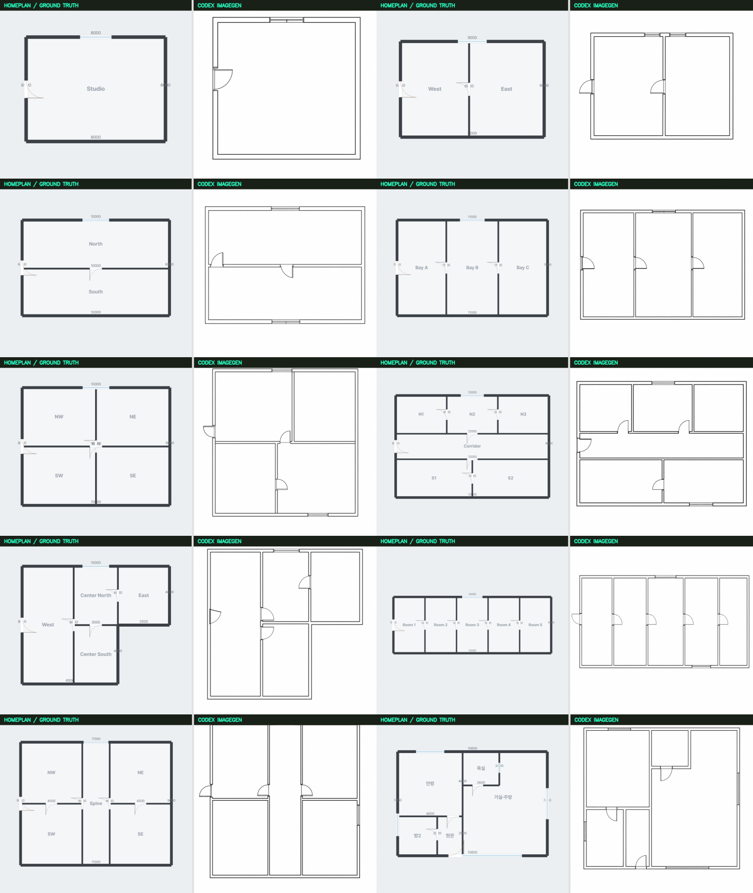

# HomePlan vs Codex imagegen 3D→2D 탐색 비교

실행일: 2026-08-31

## 결론

**도면 정확성은 HomePlan이 우세하다.** 다만 HomePlan은 같은 `Project.plan`을 직접 렌더하는 구조화 상태 상한선이고, Codex imagegen은 3D 픽셀만 보고 역복원하므로 공정한 추론 모델 대결은 아니다.

Codex imagegen은 10건 모두 방 개수와 큰 위상을 복원해 시각적 초안으로는 예상보다 강했다. 그러나 평균 외곽 종횡비 오차가 **17.76%**였고, 5건에서 창을 추가로 만들었으며 복도형·L자형·실아파트에서 문을 옮기거나 누락했다. 따라서 출력 이미지를 mm 도면이나 배치 충돌 데이터로 직접 사용할 수 없다.



## 비교 조건

- 사례: 서로 다른 정답 `Project v1` 10건
- 난이도: 방 1–6개, 세로·가로 분할, 4분할, 복도형, L자 외곽, 긴 5분할, 중앙 spine, 샘플 아파트
- 입력: 가구를 제거한 HomePlan 3D top view 1장 + 반대 방향 isometric view 2장
- 생성: built-in Codex imagegen, 사례당 1회
- 프롬프트: 모든 사례에 [동일한 고정 프롬프트](codex-imagegen-3d-to-2d-10/prompt.txt) 사용
- 사람 수정: 없음
- HomePlan 기준: 정답 Project의 2D SVG 직접 렌더

원본 Project, 3개 입력 view, HomePlan 2D, imagegen 결과, comparison과 overlay는 [전체 증거 폴더](codex-imagegen-3d-to-2d-10/)에 보존했다.

## 요약 결과

| 지표                   | HomePlan | Codex imagegen | 해석                                       |
| ---------------------- | -------: | -------------: | ------------------------------------------ |
| 방 개수 정확 일치      |    10/10 |      **10/10** | imagegen이 큰 위상은 모두 보존             |
| 벽 centerline F1       |    1.000 |      **0.918** | bbox 정합·축 정렬·허용 오차 적용 탐색 지표 |
| 개구부 위치 F1         |    1.000 |      **0.874** | comparison 수동 대조, 수정 없음            |
| bbox 정합 후 shape IoU |    1.000 |      **0.854** | 회전·이동·크기를 제거한 뒤 모양 비교       |
| 외곽 종횡비 평균 오차  |       0% |     **17.76%** | 실제 축척·비율 보존의 핵심 반증            |

HomePlan 수치는 추론 성능이 아니라 같은 정답 상태를 렌더한 상한선이다.

## 사례별 결과

| Case               | 방 T/P | 벽 F1 | 개구부 F1 | Shape IoU | 비율 오차 | 주요 반증                                             |
| ------------------ | -----: | ----: | --------: | --------: | --------: | ----------------------------------------------------- |
| 01 studio          |    1/1 | 0.800 |     1.000 |     0.838 |     22.3% | 개구부는 정확, 이중 wall 표현이 line precision에 반영 |
| 02 dual vertical   |    2/2 | 0.909 |     0.857 |     0.876 |     10.9% | 북측 창 1개 추가                                      |
| 03 dual horizontal |    2/2 | 1.000 |     0.857 |     0.867 |     11.6% | 남측 창 1개 추가                                      |
| 04 three bays      |    3/3 | 1.000 |     1.000 |     0.856 |      4.7% | 10건 중 가장 안정적                                   |
| 05 four grid       |    4/4 | 0.769 |     0.889 |     0.885 |     21.5% | 중앙 수직벽이 상·하에서 어긋나고 남측 창 추가         |
| 06 corridor six    |    6/6 | 1.000 |     0.615 |     0.819 |      9.6% | 방은 보존했지만 내부 문 3개 누락·이동                 |
| 07 L shape         |    4/4 | 0.875 |     0.800 |     0.865 |     17.5% | 수평벽 문 1개를 수직 파티션으로 이동                  |
| 08 long five       |    5/5 | 0.875 |     0.923 |     0.800 | **34.7%** | 긴 외곽을 크게 압축, 남측 창 추가                     |
| 09 central spine   |    5/5 | 1.000 |     0.923 |     0.873 |     21.6% | 동측 창 추가                                          |
| 10 apartment       |    5/5 | 0.947 |     0.875 |     0.864 |     23.2% | 내부 문 1개와 욕실 창 누락                            |

## 평가 방법

### 자동 지표

1. 생성 래스터를 회색조 threshold로 선 mask화한다.
2. Hough line 중 수평·수직 구조선을 추출한다.
3. 외곽 line bounding box를 정답 Project 범위에 정합한다. 이 단계는 이동과 크기만 제거하며 원본 종횡비 오차는 별도 보존한다.
4. 가까운 이중선을 cluster하고 긴 collinear 구간을 병합한다.
5. 정답 벽과 예측 벽을 one-to-one greedy matching하여 precision, recall과 F1을 계산한다.
6. 구조선으로 닫힌 영역 수와 정답 room polygon union의 shape IoU를 계산한다.

벽 F1은 허용 오차가 있는 탐색 지표다. 이중 wall style과 Hough 병합에 민감하므로 실측 오차를 대신하지 않는다. 특히 높은 벽 F1이 높은 비율 정확성을 뜻하지 않는다는 점을 종횡비 오차와 함께 해석해야 한다.

### 수동 지표

문·창문은 생성 결과와 정답 comparison을 나란히 보고 같은 벽과 상대 offset에 있는지 대조했다. 생성 이미지를 수정하지 않았고, 일치·추가·누락·다른 벽 이동을 [metrics.json](codex-imagegen-3d-to-2d-10/metrics.json)에 사례별로 기록했다.

## 비판 검토

1. **imagegen에 유리한 입력이다.** top view가 거의 2D 구조를 노출하고 가구와 텍스트를 제거했다. isometric-only 또는 furnished 실환경 성능은 이 결과보다 낮을 가능성이 크다.
2. **10×1회라 분산이 없다.** imagegen은 비결정론적이므로 일반 성능이나 재현성을 주장하려면 사례당 최소 3회가 필요하다.
3. **합성 구조가 9건이다.** 마지막 샘플 아파트를 제외하면 축 정렬된 의도적 기하다. 곡선·사선·다층·가림은 검증하지 않았다.
4. **HomePlan은 비교 모델이 아니라 상한선이다.** screenshot-only 역변환기가 없으므로 “알고 있는 Project를 그리기”와 “픽셀에서 추론하기”의 차이다.
5. **시각적 완성도가 정확도를 가린다.** imagegen 출력은 깨끗하고 설득력 있지만 긴 평면을 34.7% 압축하거나 창을 발명했다. 사람이 보기 좋은 결과를 시공·견적 데이터로 착각하기 쉽다.

## 제품 판단

- imagegen 결과를 그대로 `FloorPlan` 또는 mm 기반 배치 데이터로 import하지 않는다.
- 아이디어 스케치나 사람이 검토하는 시각적 draft에는 사용할 수 있다.
- 구조 데이터가 필요하면 wall/opening vectorization, 실측 calibration, schema validation과 evidence review를 반드시 거친다.
- 다음 실험은 새 기능으로 바로 승격하지 않는다. 실제 사용에서 역변환 요구가 반복될 때만 `iso-only + furnished + 3회 반복` 30건 stress test를 수행한다.

## 재현

```bash
# app running on http://127.0.0.1:5173
npx tsx scripts/capture-3d-to-2d-benchmark.ts

# after the fixed-prompt built-in imagegen outputs are placed in each case folder
python scripts/evaluate_3d_to_2d_imagegen.py
```

평가 원본은 [metrics.json](codex-imagegen-3d-to-2d-10/metrics.json), 시각 보고서는 [report.html](codex-imagegen-3d-to-2d-10/report.html)에서 확인할 수 있다.
